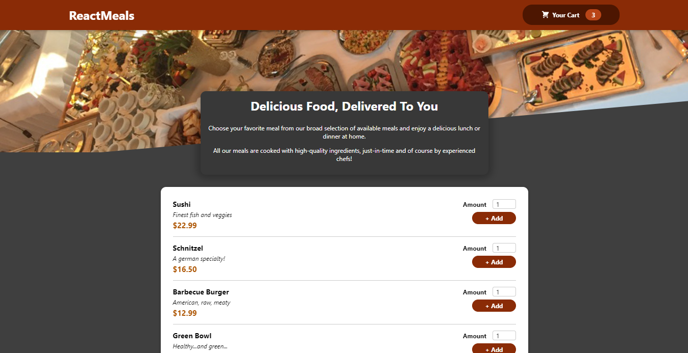

# Food Order App With React And Firebase Database

It has all the functionality working well. You can select the items you want to order and place the order. The data will be sent to the firebase database.

## Link

https://incredible-marzipan-028abe.netlify.app/

## Preview

## Installation

1. Clone the repo and `cd` into it
2. Run `npm install` to install all required dependencies (this will create a /node_modules folder)
3. You can replace my Firebase database link with your own.
4. Then Run `npm start` to serve your project to localhost:3000
5. Enjoy
